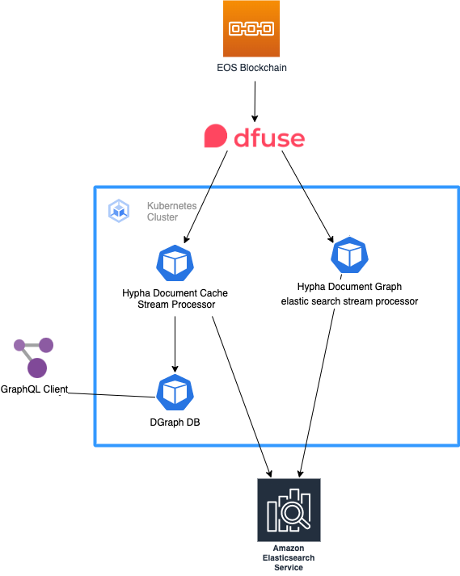

# Hypha DHO GraphQL Backend

This document outlines the technologies, architecture, and deployment process for the Hypha DHO GraphQL backend service. The deployment of the application is managed through Terraform and Kubernetes, and leverages Docker for containerization and Github Actions for continuous integration and deployment.

## Live Documentation
GraphQL interactive documentation can be found at:
- EOS MainNet - https://docs-eos-mainnet.graphql.hypha.earth/

## Technologies
The following technologies are used in the deployment of the application:

- Terraform: responsible for setting up the infrastructure.
- Kubernetes: used to deploy the application instances in a cluster.
- Helm: used to package Docker images as Helm charts for easy deployment to Kubernetes clusters.
- Docker: used to containerize the applications.
- Docker Compose: used to run applications locally.
- Github Actions: used to build application Docker images on code change.

### Kubernetes Dependencies
In addition to the technologies listed above, the deployment of the application on Kubernetes also requires the following dependencies:

- External DNS: used to maintain DNS records.
- Cert-Manager: used to manage TLS certificates.
- Ingress-Nginx: provides ingress functionality.

## Architecture

The Hypha GraphQL backend is comprised of following primary components: the Hypha Document Cache Processor, the Hypha ElasticSearch Processor, the Dgraph Database and ElasticSearch instance. 

**Document Cache Processor:**
The Document Cache Processor is responsible for caching documents in the system for quick retrieval. This component ensures that right documents, in right format and with right relations are stored in DGraph database.

**Elasticsearch Processor:**
The Elasticsearch Processor is responsible for storing the information about the current cursor position.

**Dgraph Database:**
The Dgraph Database is the primary database for the backend system. It stores all data in a graph format, making it easier to traverse and query relationships between data points.

Both the Document Cache Processor and the Elasticsearch Processor connect to a cloud hosted instance of DFuse and Firehose to stream data from the EOS blockchain. This integration allows for real-time access to blockchain data and ensures that the GraphQL backend is always up-to-date with the latest information. With these components working together, the GraphQL backend is able to provide fast and reliable access to blockchain data, as well as powerful queries for Hypha DHO.

### Hypha DHO GraphQL Architecture Diagram

  

## Deployment Process
The deployment process consists of the following steps:

- Use Terraform to set up the infrastructure.
- Package the application instances as Docker images.
- Use Helm to deploy the Docker images to the Kubernetes cluster.
- Use Github Actions to continuously build and deploy application Docker images on code change.

Detailed deployment instractions can be found at [DEPLOYMENT.md](./docs/DEPLOYMENT.md)
